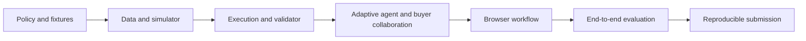

# AI Purchasing Agent — Execution Plan

Status: Planning only.  
Product contract: [PRD](PRD.md)

## 1. Delivery strategy

Build one complete purchasing-case loop before adding breadth. Prove domain correctness and action recovery independently of the LLM, then connect adaptive investigation and a buyer workbench.

Target implementation budget: eight focused hours. This estimate assumes local tooling and one provider credential are available. Record actual progress; do not sacrifice execution controls to meet an estimate.

No implementation or publication is authorized by this planning document alone. Repository creation, provider setup, and publishing become execution tasks when implementation is requested.

## 2. Decisions to finalize at implementation kickoff

Use these defaults unless the buyer/developer has a different preference:

| Decision | Proposed default | Why |
|---|---|---|
| Application | TypeScript + Next.js, one repository/process | Small deployment and shared schemas. |
| Persistence | SQLite through a lightweight migration/query layer | Reproducible local state and transactional execution. |
| Agent | Direct tool-calling loop through one provider adapter | Inspectable behavior without unnecessary framework overhead. |
| Model/provider | Select an available tool-calling model after checking current official documentation | Keep provider-specific code isolated. |
| UI | Purchasing workbench with case timeline and buyer input | Actions and validation are visible. |
| Demo | Local seeds, mock supplier API, explicit event injection | Repeatable successes and failures. |
| Currency/time | One currency; explicit node timezone and dated fixtures | Avoid hidden conversion/calendar assumptions. |
| Background processing | Explicit bounded run/resume and process-update endpoints | Fits local demo without production queue infrastructure. |

Do not block implementation over cosmetic choices. Required external inputs are provider credentials for live AI mode and GitHub identity/repository preferences for publication. No-key demo mode can be built without those inputs.

## 3. Build sequence and time budget

### Phase 1 — Domain contract and fixtures (45 minutes)

Deliver:

- Define domain types, state enums, tool schemas, policy configuration, and dated fixture format.
- Choose exact numeric fixtures for accept, modify, reject, expedite, constraint, and supplier discrepancy outcomes.
- Write expected quantities and inventory projections independently of agent output.
- Establish money in minor units and inventory/demand reservation semantics.

Exit check: each core fixture has an unambiguous expected outcome or an explicit acceptable set of outcomes; no quantities depend on an unexplained assumption.

Suggested commit: `docs: define purchasing policy and evaluation fixtures`.

### Phase 2 — Persistence and deterministic domain engine (75 minutes)

Deliver:

- Database migration and repeatable seed/reset commands.
- Daily inventory projection, service-gap and buffer metrics, peak capacity checks.
- Candidate simulation for unchanged plan, new PO, and existing-PO expedite.
- MOQ/pack rounding, supplier availability, budget, excess-stock, and quote validity checks.
- Unit tests for timing, rounding, outstanding receipts, and budget/capacity boundaries.

Exit check: simulator reproduces fixture expectations without an LLM; all feasibility outputs explain their binding constraints.

Suggested commit: `feat: add purchasing simulation and seeded business data`.

### Phase 3 — Safe execution and feedback loop (75 minutes)

Deliver:

- Persisted proposals, plan-specific approvals, and server-side policy gate.
- Transactional internal reservations/commitments and optimistic state checks.
- Mock supplier create/expedite/read-back operations with stable idempotency keys.
- Independent outcome validator.
- Failure modes: response lost after success, partial confirmation, changed delivery date, definite rejection.
- Explicit handling of unknown residual supplier obligations.

Exit check: one service-level flow creates or expedites an order, reads it back, and validates coverage; retry creates no duplicate; short confirmation remains unresolved.

Suggested commit: `feat: execute purchasing plans with reconciliation and validation`.

### Phase 4 — Dynamic agent and buyer collaboration (75 minutes)

Deliver:

- Provider adapter, schema-validated tools, and bounded agent loop.
- Agent instructions describing objective, evidence use, available capabilities, and stopping conditions.
- Persistent tool events and structured proposal output with evidence references.
- Buyer clarification/tradeoff requests and exact-plan approval flow.
- Resume after buyer answer or supplier event with refreshed evidence.
- Labeled deterministic demo runner using the same tools and policy gate.

Exit check: the live agent takes different investigation paths for a sufficient-supply case and an overdue-supply case; it cannot approve its own action or bypass the server gate.

Suggested commit: `feat: add adaptive purchasing investigation and buyer input`.

### Phase 5 — Full-stack workbench (75 minutes)

Deliver:

- Case list and case detail page.
- Before/after inventory projection, evidence summary, candidate comparison.
- Investigation/action timeline with readable statuses.
- Clarification response, approval, decline, run/resume, and supplier-event controls.
- Visible action read-back and validation findings.
- Loading, failure, empty, awaiting-buyer, and unresolved states.

Exit check: a buyer can complete the end-to-end workflow in the browser; refresh retains history and pending decisions.

Suggested commit: `feat: add purchasing exception workbench`.

### Phase 6 — Evaluation and corrective fixes (75 minutes)

Deliver:

- Execute PRD T01–T12 using domain/integration fixtures.
- Run live-agent evaluations on accept/modify, expedite, approval, and discrepancy cases.
- Include paired evidence changes that alter the correct decision.
- Save machine-readable results and a short human-readable evaluation report.
- Fix failures involving quantities, permissions, duplicates, stale state, or false success before UI polish.

Exit check: deterministic invariants pass; live-model outcomes and limitations are accurately reported; failed initial actions have a demonstrated recovery path.

Suggested commit: `test: evaluate purchasing decisions and failure recovery`.

### Phase 7 — Submission package (60 minutes)

Deliver:

- README with setup, run, reset, test, live AI/demo modes, and a short demo script.
- Architecture diagram, approach, policies, validation design, and known limitations.
- `.env.example` with placeholders only; ignore rules for secrets, generated DBs, and runtime logs.
- Clean-checkout verification using documented commands.
- Review tracked content for secrets and preserve meaningful commit history.
- Create/publish public GitHub repository when requested; verify its contents and provide URL.

Exit check: another person can run the app from the repository without hidden local services. If live AI needs a key, that dependency and the no-key demo alternative are explicit.

Suggested commit: `docs: add reproducible demo and submission instructions`.

## 4. Dependency and critical path



Write small tests alongside each domain capability; phase 6 integrates and evaluates the completed system. Do not postpone correctness checks until the end.

## 5. Proposed repository structure

```text
app/
  page.tsx                         # exception inbox
  cases/[id]/page.tsx              # purchasing workbench
  api/                            # case, run, buyer, and demo endpoints
src/
  domain/                         # types, policy, projections, constraints
  agent/                          # instructions, loop, provider adapter, tools
  services/                       # proposals, execution, validation, reconciliation
  integrations/mock-supplier/     # quotes, acknowledgements, failure injection
  db/                             # schema, migrations, repositories
  components/                     # evidence, plans, timeline, buyer controls
fixtures/                         # dated situations and expected outcomes
tests/                            # domain and integration tests
evals/                            # agent runner and result reports
docs/                             # architecture, demo script, limitations
scripts/                          # seed/reset and evaluation entry points
.env.example
.gitignore
README.md
PRD.md
EXECUTION_PLAN.md
```

Structure is a proposed boundary, not a requirement to create empty abstractions. Keep calculations pure and provider calls outside domain services.

## 6. API and run contracts

Suggested routes:

| Route | Purpose |
|---|---|
| `GET /api/cases` | List cases and next required actor. |
| `GET /api/cases/:id` | Case state, evidence, plans, interactions, and history. |
| `POST /api/cases/:id/run` | Start/resume a bounded agent run; reject conflicting active runs. |
| `POST /api/cases/:id/messages` | Persist buyer context/follow-up request. |
| `POST /api/interactions/:id/respond` | Answer a pending clarification or tradeoff question. |
| `POST /api/proposals/:id/approve` | Approve exact version and terms; no implicit execution bypass. |
| `POST /api/proposals/:id/decline` | Decline proposal and record reason. |
| `POST /api/demo/events` | Inject a labeled mock supplier update. |
| `POST /api/demo/reset` | Reset local demo data with explicit UI confirmation. |

Use typed failures such as `MISSING_EVIDENCE`, `STALE_PLAN`, `APPROVAL_REQUIRED`, `CONSTRAINT_VIOLATION`, `ACTION_OUTCOME_UNKNOWN`, and `SUPPLIER_REJECTED`. Return enough structured context for the agent to choose the next step.

Every run has a case ID, run ID, status, configured tool-call limit, and persisted event sequence. On provider failure, preserve the case and display a retryable error. Do not silently switch a failed AI run into demo mode.

### Structured proposal contract

At minimum:

```text
case_id, proposal_id, version
disposition: accept | modify | reject | investigate
action_type: keep_plan | create_po | expedite_po | none
action_arguments
evidence_references
simulation_id and source_versions
decision_summary and important_factors
assumptions and unresolved_questions
residual_exposure
approval_requirement (computed by server)
```

Separate the recommendation disposition from the intervention. Rejecting a proposed 800-unit order can still lead to expediting an existing order.

## 7. Test implementation checklist

### Domain tests

- Receipt before versus after shortage date.
- Reserved/quarantined inventory and outstanding PO quantity.
- Lost-demand accounting without negative physical stock.
- MOQ/pack rounding followed by feasibility checks.
- Budget includes fees and avoids double commitment.
- Capacity checked at receipt peak.
- Expedite moves, rather than duplicates, incoming supply.
- Missing values and zero-demand behavior.

### Execution tests

- Authorized versus approval-required action.
- Approval tied to current proposal version.
- Idempotent duplicate submission and lost-response reconciliation.
- Concurrent budget claims and stale context.
- Short/late confirmation, rejection, and ambiguous residual obligations.
- Duplicate/out-of-order supplier events.
- Validator detects mismatch independently of the agent's wording.

### Agent evaluations

- Checks decision-critical evidence before proposing execution.
- Follows a contradiction with a relevant tool or question.
- Compares timing interventions when normal replenishment is too late.
- Uses known source data rather than inventing missing values.
- Stops with a specific buyer question when required.
- Replans after validation identifies a discrepancy.
- Respects iteration limits and cannot self-authorize.

Use exact outcomes for deterministic tests and acceptable-outcome sets for agent evaluations. Save model/mode, configuration, fixture version, and observed results so results can be explained.

## 8. Demonstration script

1. Open a recommendation case proposing 800 units.
2. Run investigation and show dated inventory/supply evidence.
3. Show that the shortage is caused by delivery timing; compare a new order with expediting an existing one.
4. Show the proposed action and its before/after projection.
5. If configured above authority, approve the specific plan as the buyer.
6. Execute and display the persisted action and confirmed supplier result.
7. Show independent coverage validation.
8. Load the discrepancy fixture or inject a later/short confirmation.
9. Show the case reopening, residual exposure, and targeted follow-up or escalation.
10. Show a retry recovering the same action without a duplicate PO.

Keep the main walkthrough short. Use the evaluation report to demonstrate additional cases rather than manually clicking through every fixture.

## 9. Time-pressure rules

Preserve these requirements even under time pressure:

- Real adaptive tool use in AI mode.
- Dated inventory simulation and hard constraint enforcement.
- A complete action and validation path.
- Specific buyer approval and persistence.
- Idempotency and one meaningful failure-recovery demonstration.
- Honest reproducible documentation and evaluation results.

Cut in this order:

1. Visual polish, animation, and additional chart detail.
2. Promotion/sales-anomaly extensions and extra paired evaluations.
3. Additional supplier choices and advanced preference persistence.
4. Extra action types beyond the core new-order and expedite paths.

Do not add transfers, cancellations, sophisticated forecasting, multiple agents, or production queues during the MVP. If even the protected scope cannot be finished, document the actual gap instead of showing a scripted UI as completed autonomous behavior.

## 10. Submission checklist

- [ ] Source code and lockfile committed.
- [ ] Setup instructions verified from a clean checkout.
- [ ] Working local browser demo.
- [ ] Live AI and deterministic demo modes clearly distinguished.
- [ ] Required environment variables documented with placeholders.
- [ ] Seed dataset and mock supplier behavior included.
- [ ] Architecture and business policy documented.
- [ ] Dynamic investigation and buyer collaboration explained.
- [ ] Pre-action, post-action, and business-outcome validation explained.
- [ ] Tests and observed evaluation report included.
- [ ] Recovery and known limitations documented.
- [ ] No credentials or sensitive runtime traces committed.
- [ ] Commit history intact; deadline and submission timezone verified.
- [ ] Public GitHub repository accessible and URL ready to submit.

## 11. Next concrete step

When implementation begins, create the numeric fixture and policy contract first. Use those expected outcomes to build the simulator and executor, then attach the dynamic agent. This keeps the agent's flexibility grounded in a purchasing system whose behavior can be explained and verified.
