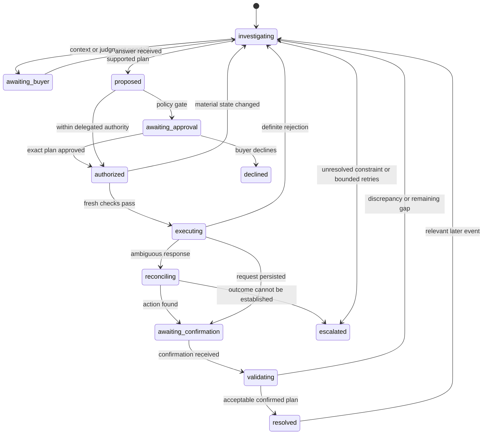
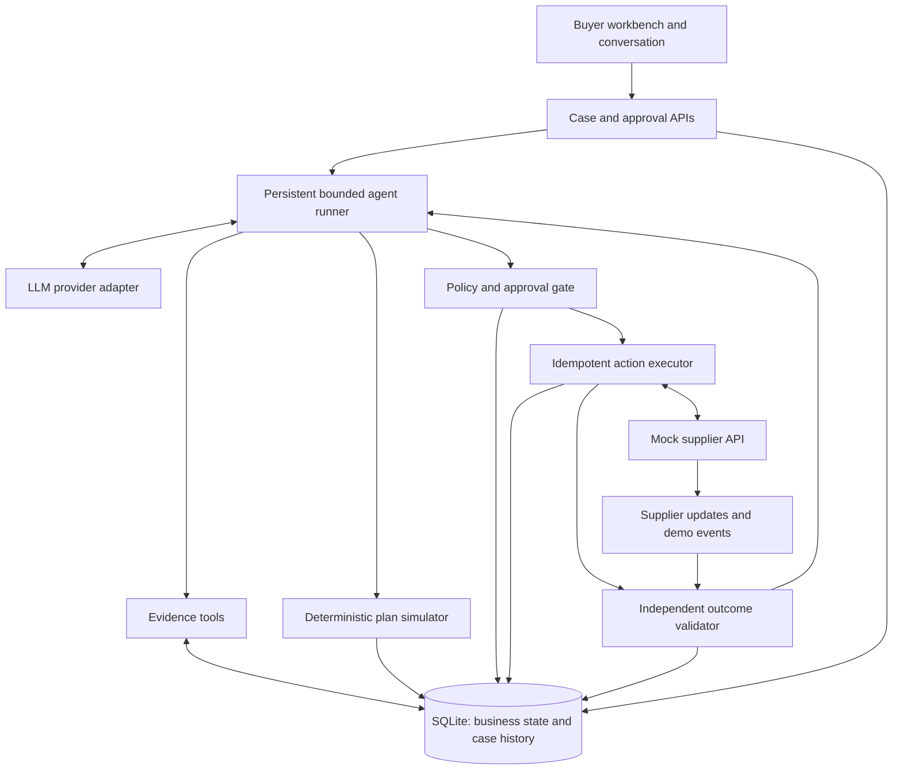

# AI Purchasing Agent — Product Requirements Document

Status: Proposed implementation baseline; no application has been built yet.  
Date: 2026-09-17  
Companion: [Execution plan](EXECUTION_PLAN.md)

## 1. Product intent

Build a full-stack purchasing assistant that owns a bounded part of a buyer's workflow: investigate a purchasing situation, identify the underlying need, compare feasible interventions, act within delegated authority, and validate the result.

The input may be a recommendation, supplier update, demand change, constraint, or buyer question. The input is evidence to investigate, not an instruction to execute blindly.

The central business question is:

> Given current evidence and purchasing policy, what should the buyer do now to maintain availability without creating unacceptable inventory, cost, or operational exposure?

The product is a persistent purchasing workbench with conversational assistance. A case, its evidence, and its actions persist independently of the chat.

## 2. Findings and design decisions from discovery

1. A fixed seven-question workflow is insufficient. Investigation must branch according to evidence, contradictions, and missing information.
2. Quantity calculations alone miss timing problems. Inventory must be projected over dated demand and receipts.
3. Forecasts and purchase recommendations can be wrong. Demand changes require investigation rather than automatic extrapolation.
4. Open POs are not equivalent to confirmed supply. Outstanding quantity, acknowledgement, delivery date, and freshness matter.
5. Creating a new PO is only one intervention. Keeping the plan or expediting existing supply may be better.
6. Constraints should trigger a search for feasible alternatives. An infeasible original recommendation does not necessarily mean no action is possible.
7. Buyer involvement has three distinct purposes: missing context, business judgment, and authorization.
8. An accepted API request does not establish success. Persisted order state and projected business impact must be checked.
9. Supplier confirmation and physical receipt are different milestones. The demo must not claim goods arrived merely because an order was confirmed.
10. Dynamic reasoning needs bounded tools, enforceable permissions, source-backed evidence, and stopping rules.
11. Breadth must not compromise the complete loop. Implement a small action set thoroughly and label unsupported interventions honestly.
12. The LLM should perform real adaptive tool use. Deterministic calculations and controls must remain independently testable.

## 3. Users, jobs, and outcomes

### Primary user: buyer

- Review exceptions without manually opening every source system.
- Understand the actual shortage or excess exposure, including when it occurs.
- See which options are feasible and why others were discarded.
- Delegate routine actions within explicit limits.
- Supply business context and decide material tradeoffs when needed.
- Know whether the action achieved the expected result or needs attention.

### Secondary user: evaluator or operator

- Inspect evidence, tool calls, calculations, policy gates, actions, and validation.
- Reproduce a case from seed data.
- Change a relevant fact and observe an appropriate change in behavior.
- Inject a failure and see safe recovery.

### Success criteria

- A recommendation can be accepted, modified, rejected, or left pending investigation with a specific reason.
- The agent chooses follow-up tools based on findings, rather than following scenario-ID branches.
- At least one situation completes investigation, action, read-back, and outcome validation.
- At least one execution discrepancy causes reconciliation or replanning.
- High-risk or unauthorized actions require a buyer decision.
- All executed actions satisfy server-enforced invariants.
- An unresolved need is never presented as fully resolved.

## 4. Scope and delivery boundary

### Required MVP

- One product and one fulfillment node per case; multiple products, nodes, and suppliers supported by the schema and seed data.
- Scenario 1, recommendation review, implemented end-to-end.
- Scenario 4, constraint handling, integrated into the same workflow.
- Three supported plan types: keep the existing plan, create a PO, expedite an eligible existing PO.
- Supplier quote/expedite responses supplied by mock tools.
- Time-based inventory simulation and deterministic constraint checks.
- Adaptive tool-calling LLM investigation and structured proposals.
- Buyer clarification, tradeoff decisions, and plan-specific approval.
- Persistent execution records, idempotency, read-back, and validation.
- Mock supplier updates for confirmation shortfalls and changed dates.
- Browser UI, seed/reset command, evaluation runner, documentation, and environment template.
- Clearly labeled deterministic demo mode for operation without an API key.

### Narrow additional coverage

- Scenario 2: a partial supplier confirmation reopens the case, recalculates coverage, and investigates a remaining need. Do not equate a supplier offer with a confirmed amendment to an existing obligation.
- Scenario 3: sales, stock availability, and promotion evidence can invalidate an existing demand assumption. Use a documented rule or buyer-confirmed assumption; do not build an autonomous forecasting system.

### Deferred

- Multi-product budget optimization, automated transfers, PO cancellation, split-delivery execution, supplier negotiation, real ERP integrations, production authentication, and production scheduling.
- Perishable inventory optimization, multi-currency, tax calculation, supplier-wide minimum spend, contractual penalty interpretation, and complex warehouse scheduling.

The agent may identify a deferred intervention as a suggestion requiring external coordination. It must not claim to execute or simulate it using capabilities that do not exist.

## 5. Business policy and explicit assumptions

All numeric policy values are demo configuration, not universal purchasing rules. Fixtures must provide concrete values before implementation tests are written.

| Topic | MVP policy |
|---|---|
| Planning horizon | Configured per fixture; sufficient to include relevant lead times and the replenishment review period. Warn when the horizon cannot support the decision. |
| Demand | Dated unit forecast plus an explicitly documented adjustment where justified. Baseline and configurable stress case are separate projections. |
| Usable stock | On-hand minus quarantine, damaged, and reserved quantities. Fixtures use future demand excluding those already-reserved commitments to avoid double counting. |
| Receipts | Confirmed outstanding quantities enter the baseline on the confirmed receipt date. Tentative receipts appear separately in a conditional projection. |
| Late POs | Overdue supply without an updated confirmation is not silently moved to today. Investigate its status. |
| Lost sales | Demo assumes unmet demand is lost, not backlogged. Record lost units separately and clamp physical inventory at zero. |
| Daily timing | Confirmed receipts arrive before that day's demand. Document that intraday stockouts are outside model resolution. |
| Availability target | Minimize projected unmet demand under the configured service policy. Distinguish unavoidable pre-arrival gaps from gaps the proposed action resolves. |
| Safety stock | Configurable target buffer; falling below it is distinct from physical stockout. |
| Excess inventory | Configurable maximum closing stock or days of cover. Zero-demand products require a unit cap rather than division by zero. |
| Budget | Single currency; committed funds deducted once. Order totals include modeled delivery or expedite fees. |
| Capacity | Per-unit storage volume and dated headroom after existing occupancy and confirmed flows. Check peak post-receipt occupancy, not only end-of-day stock. |
| Supplier | Quotes include product eligibility, available quantity, price, MOQ, pack size, delivery date, and expiry. MOQ means minimum units per order in the MVP. |
| Confirmation | A new request can be pending or partially confirmed. Unconfirmed residual quantities remain explicit obligations until clarified. |
| Unknown data | Missing evidence is not zero. Decision-critical unknowns prevent automatic execution. |

### Candidate selection

Apply hard constraints first. Among feasible plans, use an explicit ordering: meet the configured service target, avoid excess exposure, then minimize incremental cost. If service cannot be met, show a partial mitigation and its residual shortage; do not describe it as a complete solution.

The simulator returns metrics and feasibility, not a hidden weighted score. If options involve an unresolved business preference, the buyer chooses. Shared budget feasibility does not imply that this product deserves priority over all others; portfolio contention requires buyer judgment in the MVP.

## 6. Adaptive investigation requirements

### Investigation loop

1. Interpret the input and locate the product, node, and relevant purchasing case.
2. Retrieve initial context and applicable purchasing policy.
3. Identify facts or uncertainties that could change the decision.
4. Choose relevant tools, inspect results, and pursue contradictions.
5. Ask the buyer only for information or authority unavailable through tools.
6. Propose supported interventions and obtain deterministic simulations.
7. Select a supported plan, request a tradeoff decision, or escalate.
8. Execute only through the policy gate.
9. Read back actual state and validate both execution and inventory impact.
10. Resolve the current planning obligation or continue with a bounded follow-up.

There is no mandatory business-question count or fixed tool order. The server still requires sufficient evidence for the specific proposed action.

### Examples of evidence-driven branches

| Finding | Appropriate follow-up |
|---|---|
| Stock exists but availability is low | Inspect reservations, quarantine, and snapshot consistency. |
| A PO could cover the gap but is overdue | Retrieve supplier acknowledgement and updated ETA. |
| Sales rose significantly | Inspect promotion dates, recent sales, and stock availability before changing expected demand. |
| Sales fell while stock was unavailable | Flag sales as censored evidence; do not infer low underlying demand. |
| Normal delivery misses the shortage window | Check expedite eligibility and faster eligible supplier quotes. |
| MOQ creates excess or exceeds budget | Compare eligible suppliers, smaller permitted options, or buyer intervention. |
| Capacity blocks the order | Check dated capacity and supported timing alternatives; identify external coordination if needed. |
| Sources disagree | Refresh the authoritative source; ask for clarification if the contradiction remains material. |

### Evidence rules

- Each observation records source, retrieval time, effective time, and source version where available.
- Source records, buyer assertions, assumptions, and computed results are distinguishable.
- Structured system-of-record values take precedence for operational state; a buyer assertion cannot silently overwrite confirmed inventory or commitments.
- Important decision claims reference evidence IDs or simulation outputs.
- Supplier notes and other external text are data, not instructions to the agent.
- No invented prices, ETAs, tool results, or statistical confidence percentages.
- Reuse fresh evidence within a case; refresh it when a relevant event or expiry makes it stale.

### Stopping rules

Stop investigation when an adequately supported plan can be evaluated, a specific buyer answer is required, available tools cannot resolve a material uncertainty, or a configured tool/time budget is reached. Budget exhaustion produces a pending investigation with findings, not a fabricated recommendation.

Repeated identical calls without new evidence must stop. Bound automatic replanning attempts; repeated supplier failures escalate with the current exposure and attempted actions.

## 7. Buyer collaboration and personal assistant behavior

### Three interaction types

| Type | Example | Effect |
|---|---|---|
| Clarification | “The promotion calendar ends Friday, but your note says Monday. Which applies?” | Adds sourced business context; resumes investigation. |
| Business judgment | “The faster supplier prevents the projected gap at an extra cost of 120. Which tradeoff do you prefer?” | Selects an explicit preference or policy exception for this case. |
| Authorization | “Approve this 400-unit order from supplier B at the quoted total and date?” | Authorizes an exact plan version, subject to fresh execution checks. |

Questions include what is known, why the answer matters, options, consequences, and a recommendation when supported. The assistant should retrieve information itself before asking the buyer to do so.

Buyer responses are durable case events. Pending questions survive refresh. Free-text replies can inform investigation but cannot act as hidden approval; approval uses an explicit control bound to the plan.

### Approval policy

Automatic actions require complete critical evidence, feasible simulation, eligible supplier, current quote, and spend within the configured autonomy limit. Example approval triggers include high spend, expedite fees above policy, uncertain demand assumptions with material exposure, or a permitted service/excess-stock tradeoff.

Hard constraints cannot be waived through a generic approval button. Additional budget or physical capacity must be recorded and revalidated first. A supplier eligibility restriction requires an authorized master-data change outside the MVP.

An approval records plan ID/version, action details, total cost, assumptions, approver label, timestamp, and expiry. Material changes invalidate approval. Declines stop that action and may return the case to investigation if the buyer requests an alternative.

Persist only explicit buyer preferences with clear scope in the MVP. Do not infer permanent purchasing policy from a casual one-off reply.

## 8. Agent tools and responsibility boundaries

Tools return structured data and typed errors. All identifiers and arguments are schema-validated.

| Tool | Purpose | Permission |
|---|---|---|
| `get_case_context` | Identity, trigger, prior decisions, policies, available evidence summaries | Read |
| `get_inventory` | Usable stock breakdown, freshness, reservations | Read |
| `get_demand_evidence` | Forecast, sales, stock availability, promotions | Read |
| `get_open_orders` | Outstanding quantities, statuses, dates, acknowledgements | Read |
| `get_supplier_options` | Eligible quotes and expedite options with expiry | Read/mock inquiry |
| `get_constraints` | Budget, dated capacity, and action limits | Read |
| `simulate_plan` | Current plan versus candidate; feasibility and residual risk | Compute |
| `request_buyer_input` | Persist clarification or tradeoff question | Case write |
| `propose_plan` | Persist evidence-backed action proposal and simulation reference | Case write |
| `submit_plan` | Apply approval policy, revalidate, and enqueue/execute eligible action | Guarded write |
| `get_action_status` | Reconcile persisted action and supplier state | Read |
| `validate_outcome` | Compare actual result to authorized plan and recalculate coverage | Compute/case write |

The buyer approval endpoint is available to the UI, not as an agent self-approval tool. Demo event injection is also outside the agent's production tool set.

The LLM chooses investigation steps and interprets results. Code owns arithmetic, feasibility, source version checks, approval enforcement, state transitions, idempotency, and validation. The trace shows tool inputs/results and a concise evidence-backed explanation, not private chain-of-thought.

## 9. Planning and validation model

For each day, track opening physical inventory, confirmed receipts, available units, demand served, unmet demand, and closing inventory:

```text
available = opening_inventory + confirmed_receipts
served = min(available, demand)
unmet = max(0, demand - available)
closing_inventory = max(0, available - demand)
```

Evaluate safety-buffer violations separately. Include a before-action and after-action projection. A stress case changes a documented demand assumption; it is not a claimed probability distribution.

The simulator generates feasible pack-aligned quantities and applies MOQ, availability, quote validity, lead time, budget, capacity, and excess-stock policy. Money uses integer minor units. Quantities use integer units in the MVP. Expedites update an existing receipt; they must not add a duplicate receipt.

Every proposal records the source snapshot/version and simulation used. Recheck current state immediately before committing an action. A stale proposal is recomputed; material changes require a new proposal and approval if applicable.

### Three validation layers

1. **Proposal validity:** evidence is sufficient; calculations and hard constraints pass.
2. **Execution validity:** read-back matches supplier, product, node, quantity, price, date, status, and authorized tolerances; commitments are consistent.
3. **Business outcome validity:** confirmed supply provides the expected coverage, or residual exposure is explicitly reported.

Validation is implemented independently of the LLM's success claim. A pending acknowledgement produces `awaiting_confirmation`, never confirmed coverage.

## 10. Execution, persistence, and recovery

### State model



Read-only no-action decisions may resolve after validating that the existing plan is sufficient. `Resolved` means the current planning exception is addressed; it does not mean physical delivery has happened.

### Execution invariants

- No action without a persisted, simulated proposal.
- No execution requiring approval without valid approval for that version.
- No duplicate business action when requests are retried.
- No negative budget availability or overcommitted modeled capacity.
- No partial update where an order exists but its internal commitments do not.
- No automatic residual order while the original supplier obligation is ambiguous.
- No claim of business success based only on transport-level success.

Use a stable idempotency key for one intended action across retries. A revised plan gets a new action identity after checking existing commitments. The mock supplier supports lookup by key. If a real provider lacks idempotency or lookup, an ambiguous timeout requires reconciliation or escalation rather than blind retry.

Keep the internal order/action/commitment writes transactional. External supplier requests cannot share that transaction: persist the intent first, submit with a key, then record/reconcile the response. Conservative pending reservations remain until failure or cancellation is established.

Use optimistic source versions and transactional constraint rechecks to stop two cases spending the same budget. SQLite is sufficient for the demo but not a claim of distributed transaction support.

## 11. Data model

| Entity | Essential fields |
|---|---|
| Product / node | IDs, unit volume, status, timezone |
| Inventory snapshot | Product/node, on-hand, reserved, quarantine, damaged, effective time, version |
| Demand records | Product/node/date, forecast, actual sales, stock-availability evidence, promotion reference |
| Supplier / quote | Eligibility, product, price, fees, MOQ, pack size, available units, promised date, expiry |
| Purchase order | Supplier/product/node, requested/confirmed/received/cancelled quantities, dates, status, source version |
| PO acknowledgement | Confirmed quantity/date, residual disposition, effective time, external reference |
| Budget ledger | Scope, limit, reservations, commitments, action reference, version |
| Capacity projection | Node/date, occupied volume, other confirmed flows, capacity, version |
| Purchasing case | Trigger, product/node, state, latest run, unresolved need |
| Evidence record | Source reference/version, retrieved/effective time, structured value |
| Agent run / tool event | Case, mode/provider/model, tool args/result summary, timing, error |
| Proposal / simulation | Version, candidate action, evidence refs, metrics, constraints, residual risk |
| Buyer interaction | Type, question/options, response, plan reference, actor/time |
| Action / validation | Idempotency key, request, persisted result, state, validation findings |

Avoid double-counting occupancy or budget when converting a pending reservation into a confirmed commitment. Preserve previous proposals and validations for audit instead of overwriting history.

## 12. User experience

### Purchasing workbench

- Exception inbox: product/node, trigger, severity, state, next required actor.
- Case summary: buyer objective, recommendation under review, and current exposure.
- Evidence panel: inventory, dated supply, demand context, constraints, freshness, unknowns.
- Investigation timeline: tools used, observations, questions, and concise decision rationale.
- Plan comparison: unchanged baseline versus candidate options, cost, unmet units, coverage, feasibility.
- Buyer panel: targeted clarification, explicit tradeoff selection, or exact-plan approval.
- Outcome panel: submitted action, supplier confirmation, validation, residual exposure, next step.
- Conversation input for follow-up requests within the current case.

Demo controls load a fixture, reset demo data, and inject supplier events. Label these as simulation controls. Show whether the run uses an LLM or deterministic demo policy. Do not show API keys or raw sensitive provider payloads.

## 13. Architecture

Proposed stack: TypeScript, Next.js UI and server routes, SQLite, schema validation, and one tool-calling LLM provider. Exact SDK versions and APIs must be checked at implementation time. This is a proposal, not an existing dependency choice.



For the demo, run bounded server-side steps and persist after each tool/action. Resume through explicit API calls and mock update processing; do not claim a durable production background worker. Reloading the browser must preserve case state.

## 14. Edge cases and expected handling

Priority: P0 = MVP correctness or safety; P1 = meaningful extension/test if time permits; Deferred = explicit limitation.

| ID | Edge case | Required behavior | Priority |
|---|---|---|---|
| E01 | Existing confirmed supply covers the need | Reject extra purchasing; validate unchanged plan. | P0 |
| E02 | Receipt arrives after stockout begins | Report dated unmet demand; investigate supported faster options. | P0 |
| E03 | Quarantined or reserved stock inflates availability | Use usable stock with explicit demand semantics. | P0 |
| E04 | Missing, stale, or conflicting critical data | Refresh or ask a specific question; block dependent execution. | P0 |
| E05 | MOQ/pack rounding breaks budget or capacity | Recheck rounded options; find alternatives or escalate. | P0 |
| E06 | Only a partial purchase is feasible | Quantify benefit and residual gap; apply approval policy. | P0 |
| E07 | Supplier has insufficient availability | Compare eligible offers; preserve original obligations explicitly. | P0 |
| E08 | Supplier confirms less or later than requested | Read back, recalculate, reopen; do not report full resolution. | P0 |
| E09 | Submission times out after success | Look up by idempotency key; never blindly duplicate. | P0 |
| E10 | Definite supplier rejection | Release only failed-action reservations; replan or escalate. | P0 |
| E11 | Budget changes or two cases race | Transactional/version checks block stale commitments. | P0 |
| E12 | Quote expires or price changes after approval | Invalidate material assumptions; obtain updated plan/approval. | P0 |
| E13 | Buyer declines or does not respond | No execution; persist declined or waiting state. | P0 |
| E14 | Agent repeats calls or provider fails | Bounded retries; preserve evidence and return actionable pending state. | P0 |
| E15 | No feasible option resolves the shortage | Escalate with quantified impact and specific required intervention. | P0 |
| E16 | Demand spike is promotion-driven or temporary | Inspect event duration; do not extrapolate indefinitely. | P1 |
| E17 | Sales suppressed by stockout | Mark demand evidence as incomplete; do not infer low demand. | P1 |
| E18 | Existing PO is overdue/unacknowledged | Separate uncertain supply and request confirmation. | P0 |
| E19 | Expedite changes an existing receipt | Move receipt date without duplicating quantity; validate fee/date. | P0 |
| E20 | Supplier update is duplicated or out of order | Deduplicate event IDs and reject stale versions. | P0 |
| E21 | Zero demand, zero cost, invalid units, negative quantity | Validate domain values; handle zero-demand cover explicitly. | P0 |
| E22 | Capacity breached at arrival but not end of day | Check peak receipt occupancy. | P0 |
| E23 | Incoming order partially received or cancelled | Count only outstanding eligible quantity. | P0 |
| E24 | Residual supplier obligation is unknown | Clarify whether remainder is cancelled, backordered, or pending before replacement. | P0 |
| E25 | Buyer reply arrives after state changed | Resume with refreshed evidence and current proposal. | P0 |
| E26 | Retrieved text tries to override policy | Treat it as untrusted data; server gate remains authoritative. | P0 |
| E27 | Shared budget creates priority conflict | Surface portfolio tradeoff; do not claim global optimization. | P1 |
| E28 | Delivery calendar or timezone changes ETA | Use explicit dated quote and node timezone; complex calendars deferred. | P1 |
| E29 | Perishability, taxes, currencies, contracts | Identify unsupported material constraint and escalate; do not claim modeled feasibility. | Deferred |

This is a bounded risk register, not a claim to enumerate every real purchasing edge case.

## 15. Evaluation and acceptance

### Evaluation layers

1. Deterministic unit tests for projections, constraints, and money/quantity handling.
2. Integration tests for approvals, transactions, idempotency, and outcome validation.
3. Agent evaluations over fixed datasets, checking decisions, evidence, and actions rather than exact prose or tool order.
4. Browser smoke test for the full buyer workflow and persistence.

### Required scenario matrix

| ID | Situation | Expected observable outcome |
|---|---|---|
| T01 | 800-unit recommendation is justified and feasible | Accept; one PO; verified confirmed plan. |
| T02 | Smaller quantity meets policy | Modify; simulator-supported feasible quantity; no blind 800-unit order. |
| T03 | Existing stock and confirmed receipts suffice | Reject additional purchase; no PO creation. |
| T04 | Shortage is a timing problem; expedite is feasible | Expedite existing PO; no duplicate receipt or unnecessary new order. |
| T05 | Budget/capacity blocks preferred action | Compare supported alternatives; explicit partial mitigation or escalation. |
| T06 | Critical ETA or cost is unavailable | Targeted investigation/question; no dependent action. |
| T07 | Feasible action exceeds authority | Exact-plan approval required; execute only after valid approval. |
| T08 | Supplier partially confirms and residual disposition is known | Detect shortfall; recalculate; investigate remaining need. |
| T09 | Supplier response lost after action succeeds | Recover same action/order through idempotency lookup. |
| T10 | Budget changes between proposal and execution | Block stale action; replan or escalate without overspend. |
| T11 | Approval declined or plan materially changed | No unauthorized execution. |
| T12 | Supplier promises later arrival than requested | Validation fails expected timing; unresolved gap remains visible. |

Paired evaluations should change one decision-relevant fact: confirmed versus overdue PO; expedite available versus unavailable; fresh versus expired quote. Promotion-duration and stockout-censored sales pairs are stretch evaluations.

Each report records expected/actual disposition, necessary evidence obtained, constraints respected, approval behavior, actual action count, validation result, residual exposure, tool errors, and run mode. Some cases allow multiple acceptable plans; define acceptable outcomes and invariants rather than one exact tool trace.

All deterministic safety invariants must pass. Run the live agent on the core cases and report observed results honestly, including variability and failures. Never represent deterministic demo results as LLM evaluation results.

## 16. Risks and limits

- LLM tool choice can vary: use schemas, bounded loops, structured outputs, and invariant-based evaluations.
- Mock supplier behavior simplifies real integration: expose pending and ambiguous outcomes rather than assuming all requests are atomic.
- Daily projections omit intraday timing: state this in the UI/documentation where it affects interpretation.
- Single-case optimization cannot allocate enterprise-wide scarcity: escalate competing priorities.
- Evidence completeness is relative to the declared data model: unsupported material factors must remain explicit.
- No-key demo mode is reproducible but does not prove autonomous LLM investigation.
- Six to eight hours requires a narrow UI and action set. Reliability and the feedback loop take priority over extra scenario breadth.

## 17. Definition of done

- Working browser demo with persistent cases and a real tool-calling AI mode.
- At least one complete investigate → decide → execute → validate path.
- Constraint, approval, and failed/mismatched-action paths demonstrated.
- Required test matrix and documented evaluation results.
- Complete source, setup/run instructions, architecture diagram, approach, mock dataset/services, validation explanation, and `.env.example`.
- No secrets in tracked files; environment and generated database artifacts ignored.
- Meaningful commit history preserved; public repository URL prepared for submission.
- Limitations and any unimplemented requirements explicitly documented.
