# AI Purchasing Agent

An agent that reviews a purchasing situation, investigates it, decides what should
happen, executes within delegated authority, and then **checks whether what it did
actually worked**.

## Where each required artifact lives

Every item the brief asks for, in its order, with the file that holds it.

| # | Required artifact | File or directory | What you will find there |
|---|---|---|---|
| 1 | Complete source code | `backend/` · `frontend/` · `fixtures/` | FastAPI backend, React workbench, scenario data |
| 2 | README with setup and run instructions | **[`README.md` → Setup](#setup)** | Prerequisites, install, configure, seed, run, plus a troubleshooting table |
| 3 | Architecture diagram | **[`docs/ARCHITECTURE.md`](docs/ARCHITECTURE.md#components)** | Mermaid component diagram, layering rules, 18-table data model, durable-execution design |
| 4 | Description of your approach | **[`docs/DECISIONS.md`](docs/DECISIONS.md)** + [What this is and how you use it](#what-this-is-and-how-you-use-it), [How the agent works](#how-the-agent-works), [How decisions are made](#how-decisions-are-made) | The reasoning, the user-flow diagram, and what was deliberately cut |
| 5 | Test scenarios and evaluation approach | `fixtures/__init__.py` · `backend/evals/` · **[`backend/evals/report.md`](backend/evals/report.md)** | Eight scenarios, the scoring harness, and observed results from a live run |
| 6 | Mock APIs, datasets, supporting services | `backend/app/integrations/mock_supplier.py` · `fixtures/` · `backend/evals/recordings/` | Mock supplier with its own ledger, seed data, recorded model runs for no-key replay |
| 7 | How the agent's decisions are validated | `backend/app/services/validator.py` + **[Validation, in three layers](#validation-in-three-layers)** | The three checking layers, shown with a failing and a passing verdict |
| 8 | Working demo | **[`docs/media/`](docs/media)** · [`docs/DEMO.md`](docs/DEMO.md) | Three recorded live runs (described [here](#the-three-demo-recordings)), the local app, and a walkthrough script |
| 9 | `.env.example` | **[`.env.example`](.env.example)** | Provider, model, database, autonomy limits, loop bounds |

**No secrets are committed.** `.env`, database files, virtual environments and build
output are excluded by [`.gitignore`](.gitignore); `.env.example` ships empty key
placeholders only.

**Commit history is intact** — the work is in small, grouped commits rather than one
squashed drop.

## The idea in one paragraph

> The agent **proposes**. A deterministic engine decides **feasibility**. A policy
> gate **authorises**. An idempotent executor **acts**. An independent validator
> checks **what actually happened** — and when reality disagrees with the plan, the
> case **reopens and the agent replans**.
>
> The LLM never does arithmetic, never approves itself, and never declares success.

Each of those is a structural property, not a prompt instruction. The agent has no
tool that can execute a purchase; proposal terms are grounded in authoritative
records and checked by `simulate_plan`; and the validator that judges an outcome
never sees what the agent claimed.

## What this is, and how you use it

### The problem

A buyer at a company like Rappi receives more replenishment recommendations than they
can possibly check. Each one looks like a single number — *"order 800 units"* — but
deciding whether that number is right means pulling evidence from several systems:
what stock is actually sellable today, what demand is forecast, what is already on
order and when it lands, what the budget and the warehouse can absorb, and which
suppliers can deliver in time. Doing that properly takes a person twenty minutes.
Skipping it is how a company buys stock it does not need, or misses a stockout it
could have prevented.

This agent does that investigation, decides what should actually happen, acts when the
decision is inside its delegated authority, and then **checks whether the action
worked**. The buyer's job becomes reviewing an argued case, not assembling one.

### The flow

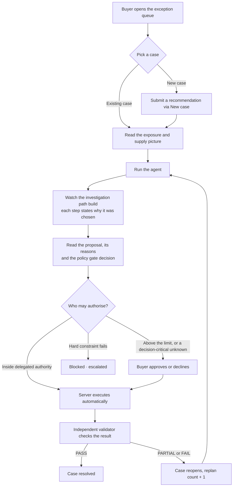

The loop at the bottom is the point: a case is not finished when the agent acts, it is
finished when the *outcome* has been checked.

### When the agent needs you: the buyer question loop

Sometimes a plan depends on a fact no system of record holds — sales mention a bulk
order that is not booked, or a promotion nobody has loaded yet. The agent cannot verify
it, and guessing either way is a decision it has no business making alone. What happens
then:

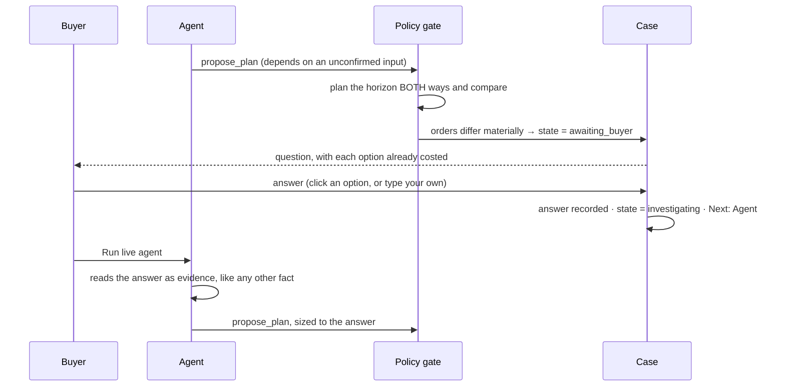

Three things in that sequence are worth knowing, because they are easy to get wrong:

1. **The stop is policy, not a mood.** `domain/sensitivity.py` plans the horizon with
   and without the unconfirmed input; if the two require materially different orders,
   `services/gate.py` halts the case — whether or not the model thought to ask. The
   agent also has its own `ask_buyer` tool and noticing earlier is better, but nothing
   depends on it doing so. Both routes produce the same question through
   `services/interactions.py`, so the UI and audit trail cannot tell them apart.
2. **Answering does not restart the agent by itself.** Your answer is recorded, the case
   returns to `investigating`, and the panel reads **Next: Agent** — you press
   `Run live agent` to continue. Runs are synchronous and this project ships with no
   queue or worker (see [docs/LIMITATIONS.md](docs/LIMITATIONS.md)); in production this
   is precisely where a durable-workflow engine would treat the answer as a signal and
   resume on its own.
3. **The answer becomes evidence, not an instruction.** The next run reads it back
   through `get_case_context` alongside inventory and quotes, and re-plans from scratch
   against it. Once answered, the gate stops citing that unknown, so you are never asked
   the same question twice.

You can watch the whole loop in [demo clip 2](#2--the-agent-stops-and-asks-because-the-answer-changes-the-order).

### Your first run

After [Setup](#setup) below, in order:

1. **Open the queue** at `http://localhost:5173`. Every case shows its incoming signal,
   projected exposure, the agent's decision so far, and where it sits in the workflow.
2. **Open `F1 · Sparkling Water`** — the case where the recommendation is wrong.
3. **Read the supply picture** before running anything, so you can judge the agent's
   answer against your own.
4. **Click `Run live agent`** (or `Replay recorded agent` if you have no API key — it
   exercises the same tools, gate, executor and validator, only the model's turns come
   from disk). Watch the investigation path build; each row states the business question
   it set out to answer and what it found.
5. **Read the proposal** and the gate decision. F1 requires your approval because the
   $450 expedite fee exceeds the $250 autonomy limit.
6. **Click `Approve and execute`.**
7. **Read the verdict.** The supplier will confirm only part of the order, so the case
   reopens.
8. **Run the agent again.** It now plans against what actually happened. Approve, and
   the second verdict comes back PASS.

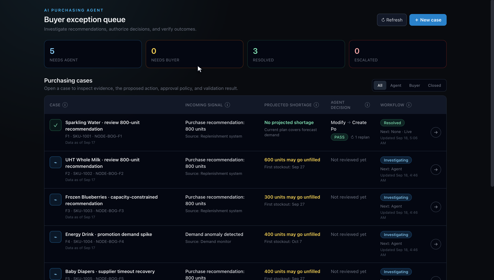

*The queue is an exception list, not a chatbot. `Agent decision` and the PASS badge mean
the reviewer can see, without opening anything, which cases were handled and which
still need them. The `1 replan` counter on F1 records that the first attempt did not
work.*

### The happy path, in one case

If you want to see a complete successful cycle before meeting the complicated one, open
**F8 · Paper Towels**. It is a small, cheap, fully covered replenishment: the agent
investigates, proposes a 550-unit order for $1,650, the gate finds it inside delegated
authority and the server executes it with no human involved, and the validator confirms
the coverage gap closed. Start to finish in about forty seconds, no approval step —
and still independently checked.

### Raising your own case

`New case` lets you submit a recommendation for any product and node. The form previews
what the system already knows and will not let you edit it:

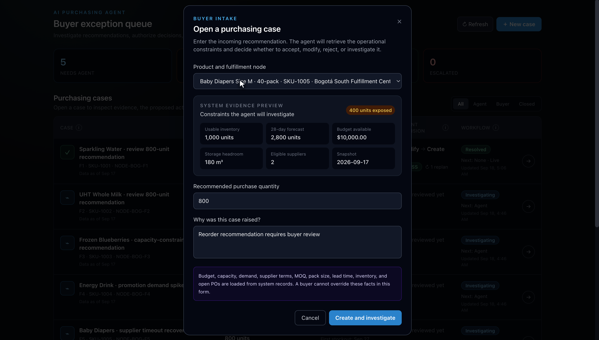

*You supply the quantity and the business reason. Inventory, forecast, budget, storage,
supplier coverage and the evidence snapshot date are read from system records — a
requester cannot tune the constraints to make their own recommendation look feasible.*

## The artifact that matters: the validation verdict

Every executed action produces one of these. It is computed from the authorised plan
and the persisted state — not from the agent's report:

```json
{
  "verdict": "PARTIAL",
  "expected": { "qty": 2000, "receipt_date": "2026-09-27", "cost_minor": 45000 },
  "actual":   { "qty": 1200, "receipt_date": "2026-09-27", "cost_minor": 45000,
                "cancelled_qty": 800,
                "supplier_note": "Only 1200 of 2000 units available. Remaining 800 cancelled, not backordered." },
  "deltas":   { "qty": -800, "cost_minor": 0, "receipt_days_late": 0 },
  "checks": [
    { "layer": "execution", "name": "supplier_and_sku_match",           "passed": true  },
    { "layer": "execution", "name": "qty_matches_authorized",           "passed": false },
    { "layer": "execution", "name": "date_matches_authorized",          "passed": true  },
    { "layer": "execution", "name": "cost_within_authorized_tolerance", "passed": true  },
    { "layer": "business",  "name": "coverage_gap_closed",              "passed": false }
  ],
  "residual_exposure": { "unmet_units": 600, "first_stockout_date": "2026-10-09" },
  "follow_up": "reopened_case"
}
```

A `PARTIAL` or `FAIL` verdict reopens the case and increments a replan counter. The
agent then replans **against what actually happened**, not against what it hoped for.

## The headline case

The brief says the recommendation *"should not necessarily be assumed to be
correct."* So the flagship fixture is one where it is wrong.

**Round 1 — the recommendation is rejected**

The system recommends buying **800 units** of SKU-1001. The agent finds:

| Fact | Value |
|---|---|
| Usable stock | 1,000 (1,200 on hand − 150 reserved − 50 quarantined) |
| Demand | 100/day for 28 days = 2,800 |
| Existing PO-501 | 2,000 units, confirmed, arriving day 14 |
| Projected shortage | **400 units**, starting 2026-09-27 |

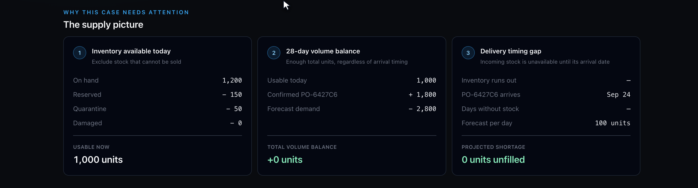

*The three calculations a buyer would otherwise do by hand. Note the middle card: the
volume balance is fine. Nothing in the raw recommendation would have told you that.*

Total supply (3,000) already exceeds total demand (2,800). **This is a timing
problem, not a volume problem.** The engine ranks every option:

```
OK     0 unmet  $   450.00  Expedite PO-501 by 4 days to 2026-09-27
OK     0 unmet  $ 7,000.00  Order 400 units from SUP-B, arriving 2026-09-20
OK     0 unmet  $ 7,500.00  Order 500 units from SUP-A, arriving 2026-09-24
OK   400 unmet  $     0.00  Keep the existing plan
XX     0 unmet  $12,000.00  Order 800 units from SUP-A  ← budget: exceeds $10,000 available
XX     0 unmet  $14,000.00  Order 800 units from SUP-B  ← budget: exceeds $10,000 available
```

The recommended 800 units is **infeasible on budget**. Expediting the order that
already exists closes the entire gap for **$450** — under 4% of the cost. The $450
fee exceeds the $250 expedite autonomy limit, so a buyer must approve it.

**Round 2 — the supplier cannot fulfil, and the case reopens**

The supplier confirms only **1,200 of 2,000** units and cancels the rest. Validation
returns **PARTIAL** with 600 units of residual exposure from 2026-10-09. The case
reopens and the agent replans:

```
OK     0 unmet  $ 9,000.00  Order 600 units from SUP-A, arriving 2026-09-24
OK   100 unmet  $ 8,750.00  Order 500 units from SUP-B, arriving 2026-09-20
OK   600 unmet  $     0.00  Keep the existing plan
XX     0 unmet  $12,000.00  Order 800 units from SUP-A  ← still over budget
```

*Now* a new purchase order is genuinely justified. SUP-A closes the gap; SUP-B is
cheaper but leaves 100 units unserved. The agent orders 600 from SUP-A, the buyer
approves, and validation returns **PASS**. Two orders, zero duplicates.

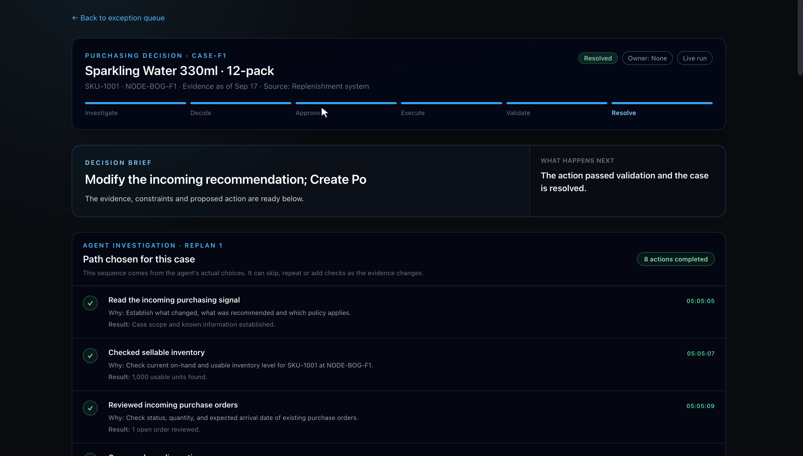

*The case after both rounds. The workflow bar has reached Resolve, and the path shown
is **Replan 1** — the second investigation, not the first. Every step records the
business question it set out to answer and what it found, because the sequence is the
model's own choice and a buyer needs to see what was actually checked.*

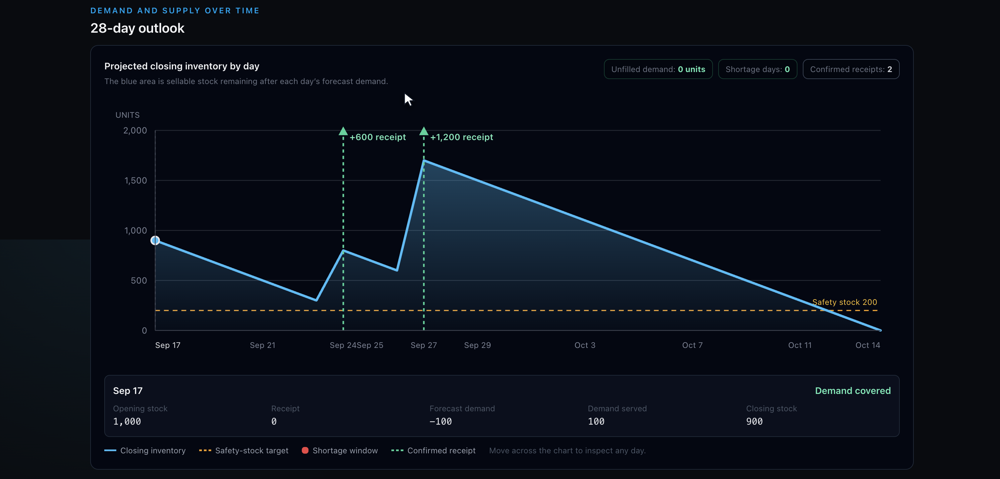

*Both receipts on one timeline: +600 on Sep 24 from the replan, +1,200 on Sep 27 from
the partially-confirmed expedite. Unfilled demand 0, shortage days 0. This is the same
projection engine the plan was chosen with, so the chart and the decision cannot
disagree.*

One narrative covers Scenario 1 (accept/modify/reject/investigate), Scenario 2
(supplier cannot fulfil), Scenario 4 (a constraint blocks the recommendation), and
the full feedback loop.

## Buyer workflow in the demo

The home page is an exception queue rather than a chatbot. It shows the incoming
signal, projected exposure, latest agent decision, workflow owner, validation status,
and replan count for every case. Open a row to see the adaptive investigation path
the agent actually chose, its reason and result for every step, the evidence,
28-day projection, feasible and infeasible plans, decision proof checklist, approval
gate, independent verdict, and technical audit log.

Buyers can also choose **New case** and submit a recommendation for an existing
product and fulfillment node. Before submission, the form previews the system's
usable inventory, forecast, budget headroom, storage headroom, supplier coverage,
and projected shortage. The buyer supplies the quantity and business reason; they
cannot edit operational constraints. This separation matters: the agent is reviewing
an incoming recommendation against source-system facts, not validating data the
requester chose to make the recommendation look feasible.

A buyer-created case can run against the live model. Recorded replay is intentionally
limited to the eight fixed evaluation fixtures because those transcripts are tied to
known evidence and expected outcomes.

## Setup

### Prerequisites

| Requirement | Version | Check with |
|---|---|---|
| Python | 3.11 or newer | `python3 --version` |
| Node.js | 22.12 or newer — required by the frontend build toolchain | `node --version` |
| npm | ships with Node | `npm --version` |

No database server, message broker or container runtime is needed. SQLite is created
on first run.

### Step 1 — Clone and install

Run everything from the repository root unless a step says otherwise.

```bash
git clone https://github.com/BLAZE7SHADOW/rappi-buyers-ai-agent.git
cd rappi-buyers-ai-agent

python3 -m venv .venv
.venv/bin/pip install -r backend/requirements.txt
```

On Windows the virtual environment puts binaries in a different folder — use
`python -m venv .venv` then `.venv\Scripts\pip install -r backend\requirements.txt`,
and substitute `.venv\Scripts\python` for `.venv/bin/python` in every command below.

*(Activating the venv with `source .venv/bin/activate` is optional. Every command here
calls `.venv/bin/python` explicitly so it works either way.)*

### Step 2 — Configure the environment

```bash
cp .env.example .env
```

Then open `.env` and paste your key into `GEMINI_API_KEY=`. Gemini is the default;
Anthropic works by setting `AI_PROVIDER=anthropic`, an Anthropic `AI_MODEL`, and
`ANTHROPIC_API_KEY`.

**No key? The demo still runs.** Leave the key blank and use the
`Replay recorded agent` button in the UI, or `evals.run_evals` without `--live`. Replay
plays back recorded model turns from `backend/evals/recordings/` while exercising the
real tools, policy gate, executor, validator and the F1 replan loop — only the model's
own turns come from disk. Every default in `.env.example` other than the keys is
already set to a working value.

### Step 3 — Seed the demo data

```bash
cd backend && PYTHONPATH=..:. ../.venv/bin/python -m app.db.seed && cd ..
```

This drops and recreates all 18 tables and loads the eight scenarios. You should see
one line per fixture:

```
F1: case=CASE-F1 sku=SKU-1001 node=NODE-BOG-F1 state=investigating expected_disposition=reject
...
F8: case=CASE-F8 sku=SKU-1008 node=NODE-BOG-F8 state=investigating expected_disposition=accept
```

Re-run this command any time to reset the demo to a clean state.

### Step 4 — Start the backend

**In a first terminal**, from the repository root:

```bash
.venv/bin/python -m uvicorn app.main:app --app-dir backend --port 8000 --host 127.0.0.1
```

Expect `Uvicorn running on http://127.0.0.1:8000`. Leave it running. Confirm with
`curl http://127.0.0.1:8000/api/health` in another shell if you want.

### Step 5 — Start the frontend

**In a second terminal**, from the repository root:

```bash
cd frontend
npm ci
npm run dev
```

Expect `➜  Local:   http://localhost:5173/`. Leave it running.

### Step 6 — Open the app

Go to **http://localhost:5173**. You should see the exception queue with eight cases.
Follow [Your first run](#your-first-run) from there.

### If something goes wrong

| Symptom | Cause and fix |
|---|---|
| `Port 8000 is already in use` | Another process holds it. Start uvicorn with `--port 8001` and change the proxy `target` in `frontend/vite.config.ts` to match — the frontend reaches the API through that proxy, not through an environment variable. |
| Frontend starts on port 5174 | 5173 was taken. Vite prints the port it actually chose — use that URL. |
| Queue is empty | The seed in Step 3 did not run, or ran from the wrong directory. It must run from `backend/`. |
| `Run live agent` is disabled | No API key was loaded. Check with `curl http://127.0.0.1:8000/api/health` — `llm_key_present` tells you what the backend actually sees. Add the key to `.env`, restart the backend, or use `Replay recorded agent`. |
| Frontend build or test fails on Node | Node older than 22.12. Check with `node --version`. |
| `ModuleNotFoundError: app` | Running a backend command without `PYTHONPATH=..:.` from `backend/`, or using system Python instead of `.venv/bin/python`. |

### Tests and evaluations

```bash
.venv/bin/python -m pytest backend/tests -q         # 87 domain, service, loop + API tests

cd frontend
npm test && npm run lint && npm run build            # component tests + static checks

cd backend
PYTHONPATH=..:. ../.venv/bin/python -m evals.run_evals                 # replay (no key needed)
PYTHONPATH=..:. ../.venv/bin/python -m evals.run_evals --live --record # call the real model
```

Evaluation output lands in `backend/evals/report.md`. The report scores each fixture
on the assignment's six evaluation questions; a question a fixture does not exercise
is marked `n/a` and excluded rather than counted as a pass.

F1 runs the agent **twice** — once to decide, and again after validation reopens the
case — so the feedback loop is exercised against the live model rather than described.
The evaluation asserts that the replan proposes something *different* from the action
that failed, and that the case actually reaches a conclusion.

## How the agent works

Nine tools. Six read evidence, one computes, two write to the case:

| Tool | Purpose |
|---|---|
| `get_case_context` | Trigger, policy, autonomy limits, prior proposals, known unknowns |
| `get_inventory` | On-hand broken into reserved / quarantined / damaged → usable |
| `get_demand_evidence` | Forecast, recent sales, stock availability, promotions |
| `get_open_orders` | Outstanding quantity, acknowledgement, overdue status |
| `get_supplier_options` | Quotes with price, MOQ, pack size, lead time, expiry, expedite terms |
| `get_constraints` | Budget headroom, storage headroom, autonomy limits |
| `simulate_plan` | **The only source of numbers** — projection before/after, feasibility |
| `propose_plan` | Records the decision; the server gates it and executes autonomous plans |
| `ask_buyer` | Asks for context or a judgement call, and pauses |

A buyer is consulted when the answer would change the order — and that is decided by
the engine, not by the model. An unconfirmed input is costed both ways; if the two
worlds need materially different orders the gate stops the case and puts the question
to the buyer with both quantities shown. Otherwise the agent decides and records its
assumption. The line is easy to get wrong in both directions — an agent that never
asks quietly guesses, and one that always asks is a form that takes longer than doing
the job — which is exactly why it is not left to a prompt. See
[docs/DECISIONS.md](docs/DECISIONS.md) for what happened when it was.

**There is deliberately no `execute` tool.** Execution happens server-side immediately
when the gate grants delegated authority, or after a buyer approves. That is why the
agent cannot approve its own spending — it is a property of the architecture, not a
promise about prompting.

The loop is bounded: 12 tool calls, 2 replans per case. Repeated identical calls are
refused with an explanation instead of looping. Running out of budget produces a
*pending investigation with findings*, never a fabricated recommendation.

After the case context is loaded, there is no fixed evidence checklist. The model
chooses the next tool from the trigger and the previous result, supplies a short
buyer-facing reason for that choice, and may skip, repeat, or add checks. That reason
is enforced at the tool layer, not merely scored afterwards: an evidence or simulation
call without one is refused and returns no data. The case page renders this actual
path as it happens; it does not display planned steps that the agent never chose.

## How decisions are made

Hard constraints first — budget, capacity, MOQ and pack size, supplier eligibility,
quote validity. Among feasible plans the ordering is explicit and stated in code:

1. meet the service target (fewest unmet units),
2. avoid excess exposure (least surplus stock),
3. minimise incremental cost.

No hidden weighted score. Infeasible options are **kept, not discarded**, because
explaining why the obvious choice was unavailable is most of the value.

Three levers exist and no more: `keep_plan`, `create_po`, `expedite_po`. Keeping the
action set this small means every action the agent can take is one a human can audit.

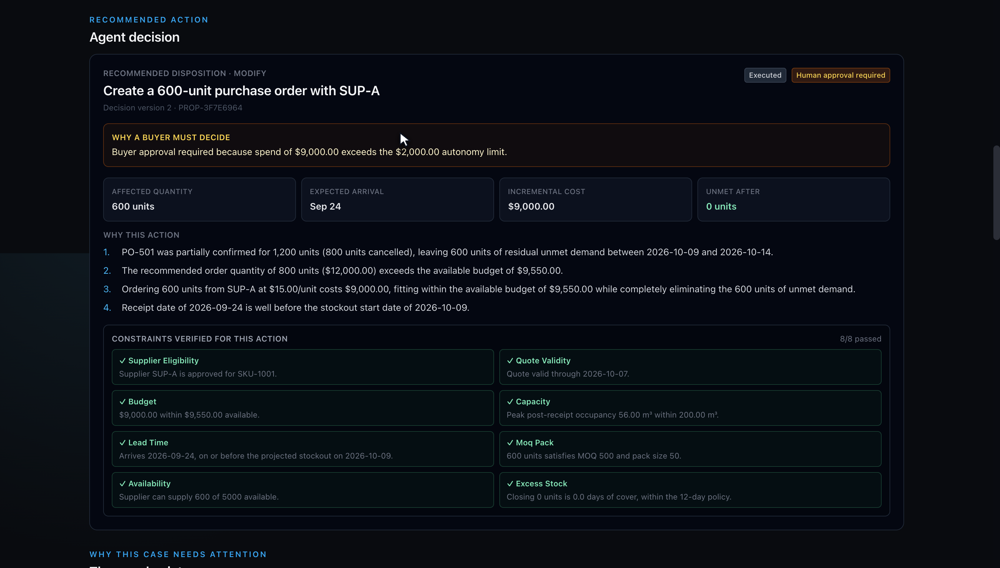

*What a buyer is actually asked to approve. The amber panel is the **gate** speaking,
not the agent: approval is required because $9,000 exceeds the $2,000 autonomy limit,
and it says so with the numbers. Below it, the four reasons are the argument, and the
eight constraint checks are the proof — each naming the value it was tested against
(`$9,000.00 within $9,550.00 available`), so a reviewer can disagree with a specific
number rather than with a verdict.*

## Validation, in three layers

1. **Proposal validity** — sufficient evidence, hard constraints pass. Checked before
   execution, and re-checked immediately before committing, because a plan approved
   ten minutes ago may no longer be affordable.
2. **Execution validity** — does the persisted order match what was authorised:
   supplier, product, node, quantity, date, charged cost?
3. **Business outcome validity** — does the confirmed supply actually close the gap
   the plan existed to close?

A pending acknowledgement is reported as *awaiting confirmation*, never as coverage.
Supplier confirmation and physical receipt are different milestones.

### What that looks like when the action fails

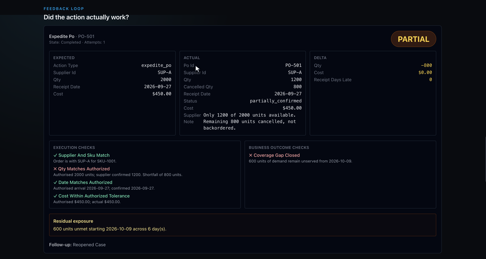

*The expedite was authorised for 2,000 units; the supplier confirmed 1,200 and
cancelled 800. Three execution checks pass — right supplier, right date, right cost —
and that is exactly why the fourth matters: **Qty Matches Authorized** fails, and the
business check **Coverage Gap Closed** fails with 600 units still unserved from Oct 9.
Verdict `PARTIAL`, follow-up `Reopened Case`.*

*This is computed from the authorised plan and the persisted state. The validator never
reads what the agent claimed — if the agent had reported complete success, this panel
would still say PARTIAL.*

### And when it works

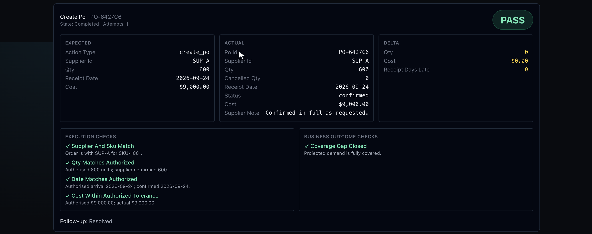

*The replan's 600-unit order, confirmed in full. Expected and actual agree on every
field, all deltas are zero, the coverage gap is closed, and the case resolves. The same
three layers ran — a PASS is a result, not the absence of checking.*

## Requirements traceability

| Requirement from the brief | Where it is satisfied |
|---|---|
| Full-stack | React + Vite workbench, FastAPI + SQLite backend |
| Investigate → decide → act | `app/agent/loop.py` → `services/gate.py` → `services/executor.py` |
| Recommendation not assumed correct | **F1** rejects the 800; **F3** modifies it down |
| Multiple interacting constraints | F1 (budget) · F3 (capacity **and** excess stock) · F6 (budget exhausted) |
| **S1** accept / modify / reject / investigate | F2 · F3 · F1 · **F7** |
| **S2** supplier cannot fulfil | F1 round 2: partial confirmation → residual exposure |
| S2 — source elsewhere / another supplier | Replan compares SUP-A vs SUP-B |
| S2 — additional PO required | F1 replan creates the 600-unit follow-up |
| S2 — existing inventory sufficient | `keep_plan` is always a scored candidate |
| S2 — escalate | F6, and bounded-retry exhaustion |
| **S3** demand / forecast changed | F4: promotion-bounded uplift + stockout-censored sales |
| **S4** constraint blocks the purchase | F1 (budget blocks the 800) · F6 (nothing feasible) |
| What information the agent needs | Tools 1–6 |
| What tools / APIs | 9 tools + mock supplier API |
| What data should exist | 18 tables, 8 fixtures |
| How decisions are made | `domain/candidates.py::rank` |
| What actions are allowed | Exactly three plan types |
| When human approval applies | `services/gate.py`; approval bound to proposal version. **F8** shows the opposite case: inside delegated authority, the gate authorises and the server executes with no human |
| How results are validated | `services/validator.py`, three layers |
| **Feedback loop** | `PARTIAL`/`FAIL` → reopen → replan → revalidate |
| Outcome differs from expected | F1 partial confirmation; F5 timeout-after-success |
| Evaluation approach | `backend/evals/`, scored on the brief's six questions |
| Architecture diagram | [docs/ARCHITECTURE.md](docs/ARCHITECTURE.md) |
| Mock APIs / datasets | `app/integrations/mock_supplier.py`, `fixtures/` |

## Test fixtures

| ID | Situation | Correct outcome |
|---|---|---|
| **F1** | 800 recommended; supply exists but lands too late | Reject → expedite → PARTIAL → reopen → 600-unit order → PASS |
| **F2** | 800 recommended, genuinely needed and affordable | Accept; one PO |
| **F3** | 800 recommended, capacity and excess limits bind | Modify down to 500 |
| **F4** | Sales running 2.6× forecast, promotion ends in 6 days | Bound the uplift; do not extrapolate |
| **F5** | Supplier commits, response lost in transit | Recover by idempotency key; exactly one order |
| **F6** | Real shortfall, zero budget | Escalate; no fabricated solution |
| **F7** | Unconfirmed bulk order that no system of record holds | Cost it both ways; stop for the buyer; order to the answer |
| **F8** | Small, cheap, fully covered replenishment | Execute and validate autonomously; no human |

## Documentation

- [docs/ARCHITECTURE.md](docs/ARCHITECTURE.md) — components, data model, durable-execution design
- [docs/DECISIONS.md](docs/DECISIONS.md) — what was deliberately cut, and why
- [docs/POLICY.md](docs/POLICY.md) — planning rules, constraints, authority and validation
- [docs/DEMO.md](docs/DEMO.md) — repeatable reviewer walkthrough
- [docs/LIMITATIONS.md](docs/LIMITATIONS.md) — what this does not model
- [backend/evals/report.md](backend/evals/report.md) — observed results against the brief’s six questions
- [docs/media/](docs/media) — three silent recordings of live runs, described in
  [The three demo recordings](#the-three-demo-recordings)
- [docs/screenshots/](docs/screenshots) — the interface stills used throughout this README

## The three demo recordings

Three silent screen recordings in [`docs/media/`](docs/media), each a **live model
run** against a freshly seeded database — not a replay, and not edited except to trim
the browser chrome. **Click any thumbnail to play.**

<!-- To embed real inline players: drag each .mp4 into a GitHub issue comment, copy the
     https://github.com/user-attachments/assets/<hash> URL it produces, and replace the
     thumbnail link below with:  <video src="<that URL>" controls></video>
     GitHub only renders a player for attachment URLs, never for repo-relative paths. -->

### 1 · The recommendation is wrong, and the first fix does not work

[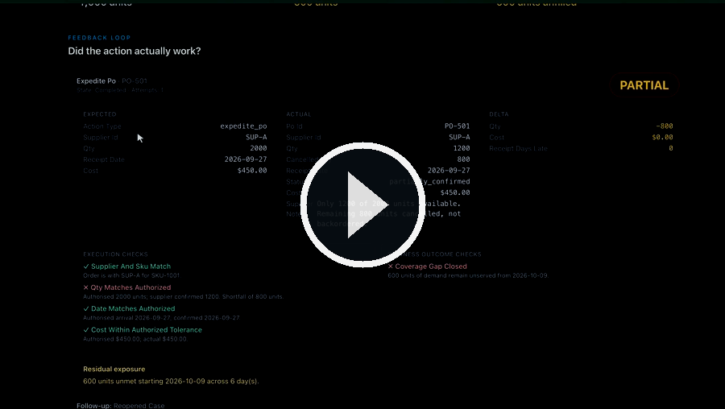](https://github.com/BLAZE7SHADOW/rappi-buyers-ai-agent/blob/main/docs/media/1-f1-reject-partial-replan-pass.mp4)

▶ **[Play the full clip](https://github.com/BLAZE7SHADOW/rappi-buyers-ai-agent/blob/main/docs/media/1-f1-reject-partial-replan-pass.mp4)** · 6 min 15 s · fixture F1 · live model run

The longest clip, and the one that shows the whole thesis. In order:

1. The case opens on **400 units of demand may go unfilled**, and the supply picture
   resolves 1,200 on hand into 1,000 usable — 150 reserved, 50 quarantined.
2. `Run live agent`. The investigation path builds on screen, a step at a time: read the
   signal, check sellable inventory, review open orders, compare suppliers, check
   constraints, compare candidate actions. A live row reads *"Choosing the next
   investigation step — the agent is deciding whether it has enough evidence, needs
   another check, should ask the buyer, or can propose an action."* Nothing here is a
   fixed checklist; it is the model's own sequence.
3. The proposal comes back **reject** — the recommended 800 units is infeasible on
   budget — with the action **expedite PO-501** for $450.
4. The gate requires approval: the $450 fee exceeds the $250 expedite limit. Approved.
5. **The supplier confirms only 1,200 of 2,000 units** and cancels the rest. The verdict
   panel shows expected vs actual vs delta, `Qty Matches Authorized` red,
   `Coverage Gap Closed` red, **600 units unmet starting 2026-10-09**, verdict
   **PARTIAL**, follow-up *Reopened Case*. The projection chart grows a shortage window.
6. `Run live agent` again. This run is labelled **Replan 1**, and it plans against what
   actually happened rather than what was hoped for.
7. A 600-unit SUP-A order at $9,000 is proposed, approved, confirmed in full — verdict
   **PASS**, and the case reaches *Resolved* with the workflow bar complete.

Two orders, no duplicates, and the second order exists only because the system checked
its own work.

**What is handling each step**

| On screen | Underneath |
|---|---|
| The path fills in, one row at a time | `app/agent/loop.py` — the model chooses each tool from the last result; the tool layer **refuses** any evidence call that does not state the business question it answers |
| Candidate actions compared, the 800 struck out | `domain/candidates.py::rank` — service target, then excess, then cost; infeasible options are kept with the constraint that bound them |
| "Buyer approval required because $450 exceeds the $250 limit" | `services/gate.py` — deterministic policy decides who may authorise; the model has no say and no tool that can execute |
| Supplier confirms 1,200 of 2,000 | `integrations/mock_supplier.py` — commits to its own ledger, in its own transaction, keyed by idempotency key |
| PARTIAL, with `Qty` and `Coverage Gap` red | `services/validator.py` — computed from the authorised plan and persisted state; it never reads the agent's report |
| Case reopens, `Replan 1` | `services/proposals.py` routes the verdict and increments the replan counter; the next run plans against the new state |

### 2 · The agent stops and asks, because the answer changes the order

[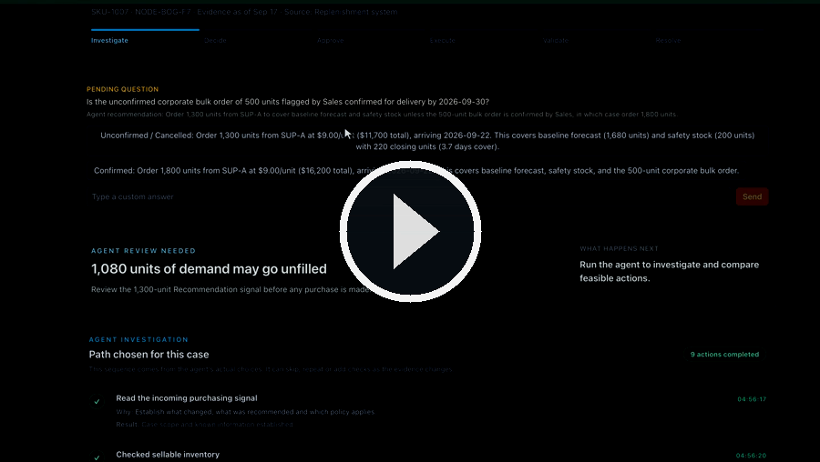](https://github.com/BLAZE7SHADOW/rappi-buyers-ai-agent/blob/main/docs/media/2-f7-agent-asks-the-buyer.mp4)

▶ **[Play the full clip](https://github.com/BLAZE7SHADOW/rappi-buyers-ai-agent/blob/main/docs/media/2-f7-agent-asks-the-buyer.mp4)** · 4 min 08 s · fixture F7 · live model run

Sales have mentioned a possible 500-unit corporate order that exists in no forecast, no
promotion and no purchase order. In the clip:

1. The agent investigates as usual, then the case stops at **`awaiting_buyer`** instead
   of proposing.
2. The pending question shows the horizon costed **both ways**, with the consequence of
   each spelled out: *Unconfirmed — order 1,300 units ($11,700), covering baseline
   forecast and safety stock* versus *Confirmed — order 1,800 units ($16,200), covering
   the corporate order as well.*
3. `Confirmed` is chosen, and the agent resumes. Its stated first reason becomes
   **"Buyer confirmed the 500-unit corporate bulk order, increasing the required
   purchase quantity from 1,300 to 1,800 units."** The order follows the answer.
4. The gate requires approval — $16,200 exceeds the $2,000 autonomy limit — and names
   both reasons: the spend, *and* that the order depended on an unconfirmed input.
   Approved, executed, validated, resolved.

What the clip cannot show, and is the important part: **the stop is not the model
choosing to be careful.** The plan is simulated under both assumptions and the gate
halts the case when the two require materially different orders, whether or not the
agent thought to ask. Before it worked this way, the model asked in about half of runs.

**What is handling each step**

| On screen | Underneath |
|---|---|
| The unconfirmed signal is read as data, not prose | `fixtures/__init__.py` carries it as a structured `unverified_demand_signal`, so something other than the model can act on it |
| The horizon costed both ways | `domain/sensitivity.py` — plans twice, once with the signal applied as a demand override, and compares the required order |
| "Materially different" | A `PolicyConfig` threshold — proportional to the order with a floor — so the line is configuration, not a magic number |
| The case stops at `awaiting_buyer` | `services/gate.py` raises `decision_sensitive_to_unconfirmed_input`; `services/interactions.py` opens the question and moves the case in the same transaction |
| Answering resumes the run | The gate stops citing the input once it has been answered, so the buyer is never asked twice |

### 3 · The agent acts alone, and is still checked

[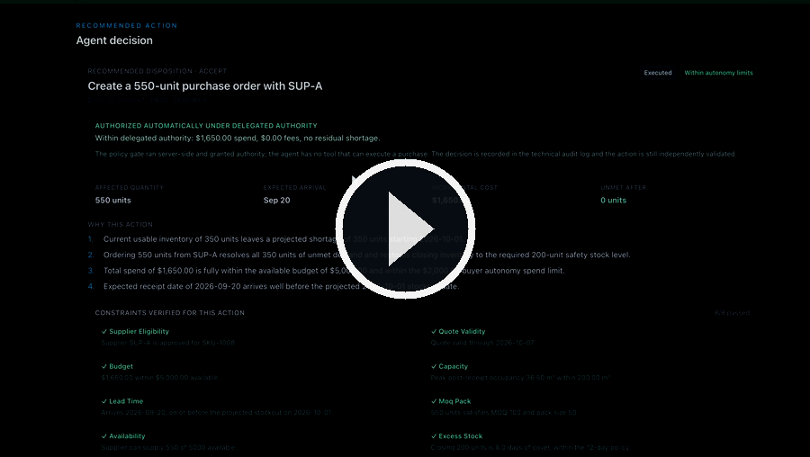](https://github.com/BLAZE7SHADOW/rappi-buyers-ai-agent/blob/main/docs/media/3-f8-autonomous-within-authority.mp4)

▶ **[Play the full clip](https://github.com/BLAZE7SHADOW/rappi-buyers-ai-agent/blob/main/docs/media/3-f8-autonomous-within-authority.mp4)** · 2 min 26 s · fixture F8 · live model run

The opposite case, and the reason the previous one is not just caution:

1. A small replenishment — 550 units, $1,650. The agent investigates and proposes.
2. **No approval step appears.** The green panel reads *"Authorized automatically under
   delegated authority: $1,650.00 spend, $0.00 fees, no residual shortage"*, followed by
   the line that matters — *the policy gate ran server-side and granted authority; the
   agent has no tool that can execute a purchase.*
3. Eight constraints verified, badges reading `Executed` and `Within autonomy limits`.
4. The validator still runs, independently, and confirms the coverage gap closed.

**What is handling each step**

| On screen | Underneath |
|---|---|
| No approval step appears | `services/gate.py` returns `AUTONOMOUS` — spend inside the limit, no residual shortage, evidence complete |
| The order is placed with no human | `services/proposals.py` calls the executor directly on an autonomous decision; the agent still has no tool that can do this |
| `Executed` · `Within autonomy limits` | The gate's own decision, recorded on the proposal and in the audit log, not a label the model wrote |
| The verdict panel appears anyway | `services/validator.py` runs on every action regardless of who authorised it |

Autonomy here is a policy outcome with its reasoning on screen, not an absence of
policy.

## Modelling assumptions

Stated here because they change how the numbers should be read:

- **Daily resolution.** Intraday stockouts are outside the model.
- **Receipts arrive before that day's demand.** A delivery landing on the day stock
  would run out prevents the stockout.
- **Unmet demand is lost, not backlogged.** It is recorded separately and physical
  inventory is clamped at zero.
- **Only confirmed supply enters the baseline.** Overdue or unacknowledged orders are
  surfaced as uncertainty rather than silently counted.
- **One currency, integer minor units.** No FX, no tax.
