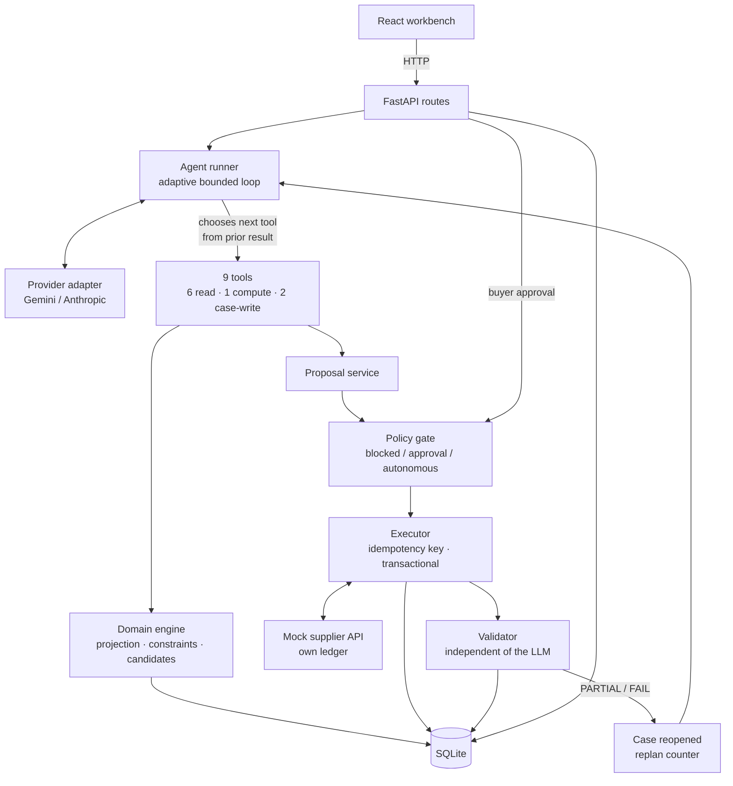

# Architecture

## Components



The one-way arrow that matters: **the agent runner reaches the gate only through
`propose_plan`.** There is no tool wired to the executor. An agent that decides it
has permission to spend cannot act on that belief.

## Layering

| Layer | Path | Rule |
|---|---|---|
| Domain | `app/domain/` | Pure functions over dataclasses. No DB, no network, no LLM. |
| Repository | `app/db/repo.py` | The only place rows become domain objects. |
| Services | `app/services/` | Gate, executor, validator, proposal lifecycle. |
| Agent | `app/agent/` | Tools, prompt, loop, provider adapters. |
| API | `app/api/` | HTTP surface with typed error codes. |

The domain layer's purity is what makes the claim "the agent cannot get the
arithmetic wrong" checkable rather than rhetorical: those functions are tested in
isolation with no mocking, and they are the only path to a number.

## Adaptive request flow for one decision

```
POST /api/cases/{id}/run
  → get_case_context               (required entry point: trigger, policy, unknowns)
  → model chooses the smallest next check that can change the decision
       ↳ read inventory, demand, orders, suppliers or constraints as relevant
       ↳ every selected call records a buyer-facing business reason
       ↳ after each result: stop, ask buyer, inspect another source, or simulate
       ↳ checks may be skipped, reordered or repeated; there is no fixed checklist
  → simulate_plan                  (compare candidates or test one hypothesis)
  → propose_plan | ask_buyer       (terminal action for this run)
        → gate.evaluate()          (server decides: blocked / approval / autonomous)
        → autonomous → executor.execute() → validator.validate_action()
  → case state = awaiting_approval | resolved | reopened | escalated | investigating

POST /api/proposals/{id}/approve
  → revalidate against CURRENT state   (budget may have moved; quotes may have expired)
  → executor.execute()
        persist intent → supplier call → apply effects atomically
  → validator.validate_action()        (reads persisted state, not the agent's claims)
  → PASS → resolved   |   PARTIAL / FAIL → reopened, replan_count += 1
```

The React page polls the case while a run is active and translates the append-only
tool events into a buyer-facing path. It renders only calls that actually happened;
the unmodified payload remains under the collapsed technical audit log.

## Data model

18 tables. The ones carrying the design:

| Table | Why it exists in this shape |
|---|---|
| `cases` | Stores trigger provenance in `signal_source`, the operational `as_of_date`, immutable `created_at`, and event-driven `updated_at` so queue dates are auditable rather than inferred in the UI. |
| `case_events` | Append-only. Backs the UI timeline, the audit trail and the evaluation assertions. Never updated, only inserted. |
| `actions` | `idempotency_key` is UNIQUE. This is the constraint that makes duplicate suppression enforceable rather than best-effort. |
| `supplier_ledger` | The supplier's *own* record, deliberately separate from `purchase_orders`. |
| `proposals` | Versioned. Approval binds to `(proposal_id, version)`, so a materially changed plan needs fresh authorisation. |
| `purchase_orders` | `version` column for optimistic concurrency; `confirmed_qty` is net of cancellation by convention. |
| `budgets` | `committed` and `reserved` tracked separately so two cases cannot claim the same funds. |

## Why the supplier has its own table

The interesting failures in purchasing integrations live at the system boundary.
Modelling the supplier as a separate store keyed by idempotency key is what makes
this reachable:

1. The executor persists intent.
2. It calls the supplier. The supplier commits to **its own** ledger in **its own**
   transaction.
3. The response is lost.
4. The executor asks the supplier what it recorded for that key, finds the
   commitment, and reconciles.

If the ledger write shared the caller's transaction, raising a timeout would roll
back the very commit the recovery path depends on — which is exactly the bug the
integration tests caught during development.

## Durable execution

A purchasing case is a long-running workflow: it spans multiple model turns, waits
on a human, calls an external system that fails, and must survive a restart.

In production this belongs on Temporal — the case is the workflow, buyer approval is
a signal, supplier calls are activities with idempotency keys and retry policies.
For a take-home that must run from a clean checkout with no infrastructure, the same
properties are implemented directly:

| Temporal concept | Implementation |
|---|---|
| Workflow state | `cases.state`, persisted after every step |
| Event history | `case_events`, append-only |
| Activity idempotency | `actions.idempotency_key` UNIQUE + supplier lookup |
| Signals | run/resume, buyer approval, supplier event injection |
| Retry policy, non-retryable failure | bounded attempts → `escalated` |

`app/services/workflow.py` holds the `step` helper that records each unit of work's
boundaries, so the mapping is visible in code rather than only in prose.

## Concurrency

SQLite is the default because it runs with no infrastructure. The concurrency design
does not depend on it:

- Optimistic version checks on `purchase_orders` and `budgets`; a stale writer fails
  rather than overwriting.
- Internal effects commit in a single transaction.
- WAL mode so reads do not block the writer.

The SQL is intentionally portable, but PostgreSQL is not part of the verified demo:
a deployment would still need the matching database driver and integration tests.

## Bounds

| Bound | Value | Behaviour at the limit |
|---|---|---|
| Tool calls per run | 12 | Pending investigation with findings; no fabricated recommendation |
| Replans per case | 2 | Escalate to a human |
| Repeated identical tool call | — | Refused with an explanation instead of looping |
| Spend without approval | $2,000 | Approval required |
| Expedite fee without approval | $250 | Approval required |
